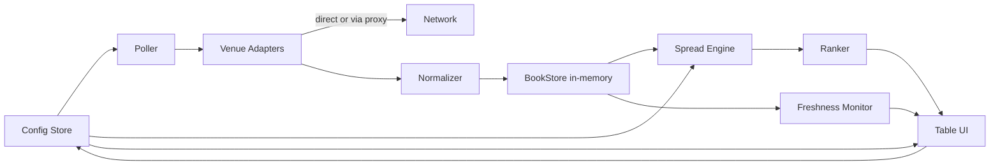

# XRP Cross-Exchange Spread Calculator — Phase 1 PRD

**Owner:** Kevin Jones
**Status:** Ready for build
**Target:** Hand off to agentic coder (Claude Code)
**Estimated effort:** 5–8 focused days, single dev
**Last updated:** May 12, 2026

---

## 1. Goal

Browser-only calculator that ranks cross-venue XRP arbitrage opportunities by **depth-weighted net spread after fees**. Read-only — no execution, no auth, no inventory. Answers one question: *"At $X notional, which buy-venue → sell-venue pair has the highest net edge right now?"*

This is the discovery layer. Execution is explicitly Phase 2+.

## 2. Scope

### In scope
- Poll public REST L2 order books across 5–8 venues at configurable interval
- Compute depth-weighted VWAP for buy and sell at configurable notional (default presets: $1K / $10K / $50K)
- Compute net edge after taker fees (per-venue, user-overridable)
- Rank top N buy/sell venue pairs by net bps
- Per-venue freshness indicator + stale-data flagging
- Auto-refresh at configurable interval (default 5s)
- Dark, minimalist, NASA JPL-style UI

### Out of scope (defer)
- WebSocket streaming, local book reconstruction → Phase 2
- Order placement, balances, inventory → Phase 3
- Authenticated endpoints, API keys → Phase 3
- Backtesting, historical replay, persistence → Phase 4
- Cross-stable basis correction beyond display labeling → Phase 2
- Triangular arb → Phase 4
- Mobile-optimized layout → Phase 2 (must be readable, not optimized)

## 3. Stack

| Layer | Choice | Reason |
|---|---|---|
| Language | TypeScript | Adapter response shapes diverge sharply between venues; types prevent bugs |
| Bundler | Vite | Zero-config, fast HMR, single `npm run dev` |
| UI | Vanilla TS + Tailwind CSS | No React; UI is one table + a control panel |
| HTTP | Native `fetch` + `AbortController` | No axios. Per-request timeouts + cancellation on refresh |
| Math | Native JS floats; Decimal.js only if precision issues surface | XRP ~$2.50 with 4dp sizes fits double safely |
| Tests | Vitest | VWAP math + adapter parsers must have fixture-based unit tests |
| Persistence | None (in-memory only) | Phase 2 if needed |
| Deploy | Static `dist/` → local dev server or GitHub Pages | No backend; works on Janus or any static host |

## 4. Venue coverage

**Tier 1 (US-accessible, native CORS, ship first):**

| Venue | Symbol | Endpoint | Max depth | Maker | Taker | CORS |
|---|---|---|---|---|---|---|
| Kraken | `XRPUSD` / `XRPUSDT` / `XRPUSDC` / `XRPEUR` | `https://api.kraken.com/0/public/Depth?pair=XRPUSD&count=500` | 500 | 0.25% | 0.40% | ✅ |
| Coinbase Exchange | `XRP-USD` / `XRP-USDC` / `XRP-EUR` | `https://api.exchange.coinbase.com/products/XRP-USD/book?level=2` | 50 aggregated | 0.60% | 1.20% | ✅ |
| Bitstamp | `xrpusd` / `xrpusdt` / `xrpusdc` / `xrpeur` (lowercase) | `https://www.bitstamp.net/api/v2/order_book/xrpusd/` | 100/side | 0.30% | 0.40% | ✅ |
| Gemini | `xrpusd` (no USDT/USDC) | `https://api.gemini.com/v1/book/xrpusd?limit_bids=50&limit_asks=50` | Unbounded | 0.60% | 1.20% | ✅ |
| Bitfinex | `tXRPUSD` / `tXRPUST` (UST = USDT) | `https://api-pub.bitfinex.com/v2/book/tXRPUSD/P0?len=100` | 100 (250 raw) | **0%** | **0%** | ✅ |

**Tier 2 (global, requires CORS proxy, behind feature flag):**

| Venue | Symbol | Endpoint | Max depth | Maker | Taker | CORS |
|---|---|---|---|---|---|---|
| Binance | `XRPUSDT` / `XRPUSDC` / `XRPFDUSD` | `https://api.binance.com/api/v3/depth?symbol=XRPUSDT&limit=500` | 5000 | 0.10% | 0.10% | ❌ |
| OKX | `XRP-USDT` / `XRP-USDC` | `https://www.okx.com/api/v5/market/books?instId=XRP-USDT&sz=400` | 400 | 0.08% | 0.10% | ✅ (verify) |
| Bybit | `XRPUSDT` / `XRPUSDC` | `https://api.bybit.com/v5/market/orderbook?category=spot&symbol=XRPUSDT&limit=200` | 200 | 0.10% | 0.10% | ⚠️ Test first |

**Deferred to Phase 2** (US-banned + shallow-REST + CORS-proxy required): KuCoin, Gate.io, HTX, Crypto.com Exchange.

### Response shape quirks to code around

- **Kraken** wraps response in `result.XXRPZUSD` (legacy symbol). Each level is `[price, volume, timestamp]` as strings.
- **Coinbase** levels are `[price, size, num_orders]` as strings at level=2.
- **Gemini** bid/ask entries are **objects** (`{price, amount, timestamp}`), not tuples. Only venue with this shape.
- **Bitfinex** v2 returns bids + asks in **one combined array**; asks have negative `AMOUNT`. Split client-side.
- **Bitstamp** values are strings; cast to number.
- **Binance** levels are `[price, qty]` strings.
- **OKX** levels are `[price, size, liquidated_orders, num_orders]`.
- **Bybit** v5 wraps in `result.b` and `result.a`.

## 5. Architecture



**Flow:** Poller fires every N seconds → each adapter fetches in parallel with `AbortSignal` → normalized to canonical `OrderBook` → stored → Engine computes VWAP buy/sell for every venue at current notional → Ranker generates all cross-venue pairs and sorts by net bps → UI renders top results. Single venue failure is isolated; others continue.

## 6. Core types & adapter contract

```ts
// src/types.ts
export type Quote = 'USD' | 'USDT' | 'USDC' | 'EUR';

export interface OrderBook {
  venue: string;
  symbol: string;          // canonical e.g. "XRP/USDT"
  quote: Quote;
  bids: [number, number][]; // [price, size], desc by price
  asks: [number, number][]; // [price, size], asc by price
  venueTs: number | null;   // venue-reported ms timestamp if available
  fetchedAt: number;        // local Date.now() at fetch start
}

export interface VenueAdapter {
  venue: string;
  supportedQuotes: ReadonlySet<Quote>;
  defaultMakerBps: number;
  defaultTakerBps: number;
  corsDirect: boolean;
  fetchBook(quote: Quote, signal: AbortSignal): Promise<OrderBook>;
}

export interface VwapResult {
  side: 'buy' | 'sell';
  notional: number;       // input USD notional
  filledBase: number;     // XRP filled
  filledQuote: number;    // USD spent or received
  avgPrice: number;       // VWAP
  levelsConsumed: number;
  fullyFilled: boolean;   // false if book lacks depth
}

export interface SpreadOpportunity {
  buyVenue: string;
  sellVenue: string;
  quote: Quote;
  notional: number;
  buyVwap: number;
  sellVwap: number;
  grossBps: number;       // (sell - buy) / buy * 10_000
  netBps: number;         // after both takers
  buyTakerBps: number;
  sellTakerBps: number;
  maxClearedNotional: number; // smaller of buy/sell filledQuote
  buyVenueStaleMs: number;
  sellVenueStaleMs: number;
}
```

## 7. VWAP math

Walk the book by **quote notional** (natural for arbitrage sizing). Symmetric on bids for sells.

```
Given target quote notional N and asks [[p1,q1], [p2,q2], ...] (asc price):
  quote_remaining = N
  base_filled = 0, quote_spent = 0
  for (price, size) in asks:
    level_cap = price * size
    if quote_remaining >= level_cap:
      quote_spent  += level_cap
      base_filled  += size
      quote_remaining -= level_cap
    else:
      base_taken = quote_remaining / price
      quote_spent += quote_remaining
      base_filled += base_taken
      quote_remaining = 0
      break
  if quote_remaining > 0: return { fullyFilled: false, ... }
  avg = quote_spent / base_filled
```

**Net edge formula (round-trip taker/taker):**

```
buy_cost_per_xrp  = buyVwap  * (1 + buyTakerBps  / 10_000)
sell_recv_per_xrp = sellVwap * (1 - sellTakerBps / 10_000)
net_edge_bps      = (sell_recv_per_xrp - buy_cost_per_xrp) / buy_cost_per_xrp * 10_000
```

**Reference test fixture** (must pass in unit tests):

Buy $10,000 through asks `[[2.50, 1000], [2.51, 5000], [2.52, 10000]]`:
- Level 1 full: spend $2,500, get 1,000 XRP
- Level 2 partial: spend $7,500 / 2.51 = 2,988.0478 XRP
- Total: 3,988.0478 XRP at VWAP $2.50751
- Mid $2.495 → slippage 50.1 bps

## 8. CORS strategy

**Tier 1 venues:** direct fetch — Kraken, Coinbase, Bitstamp, Gemini, Bitfinex all send `Access-Control-Allow-Origin: *`. No proxy needed.

**Tier 2 venues:** layered fallback chain in `src/lib/proxy.ts`:

```ts
const PROXY_CHAIN = [
  (url: string) => `https://corsproxy.io/?url=${encodeURIComponent(url)}`,
  (url: string) => `https://thingproxy.freeboard.io/fetch/${url}`,
  (url: string) => `https://api.allorigins.win/raw?url=${encodeURIComponent(url)}`,
];
```

Try in order on failure. `corsproxy.io` is free for `localhost`, `*.github.io`, and major dev sandboxes — fine for our targets. Mark proxied responses with elevated stale tolerance (their latency is variable). If serious production reliability ever matters, swap in a Cloudflare Worker proxy (15 lines, 100k req/day free).

## 9. UI requirements

**Style:** dark mode, minimal, JPL-aesthetic. Mono fonts for numbers (`JetBrains Mono` or system mono). Color tokens via CSS vars. No images, no logos.

**Layout (desktop-first):**

```
┌────────────────────────────────────────────────────────────────┐
│  XRP Arb Calc        [● live]  last update: 14:32:07.4         │
├────────────────────────────────────────────────────────────────┤
│ Notional: [$10,000 ▼]  Quote: [USD ▼] [USDT ▼] [USDC ▼]        │
│ Refresh:  [5s ▼]       Filter: [☑ US-only]                     │
│ Venues:   [☑ Kraken] [☑ Coinbase] [☑ Bitstamp] [☑ Gemini] ...  │
├────────────────────────────────────────────────────────────────┤
│ #  Buy →     Sell     Gross   Net    Cleared  Buy age  Sell age│
│ 1  Bitfinex  Coinbase 42 bps  18 bps $10,000  0.4s     1.2s    │
│ 2  Binance   Kraken   31 bps  11 bps $10,000  2.1s*    0.8s    │
│ 3  ...                                                          │
├────────────────────────────────────────────────────────────────┤
│ Venue status: Kraken ✓ 0.4s | Coinbase ✓ 1.2s | Binance ⚠ 2.1s │
└────────────────────────────────────────────────────────────────┘
```

**Color rules for net bps column:**
- net > 30 bps: green (`--color-edge-strong`)
- 10–30 bps: amber (`--color-edge-weak`)
- < 10 bps or negative: muted/red

**Freshness:** show age in seconds; flag > 2× poll interval as stale (amber `*`); > 4× hide row entirely.

**Controls drive config; config drives polling.** All state in a single `Config` object; UI re-renders on each book update via a simple pub/sub.

## 10. File structure

```
xrp-arb-calc/
├── index.html
├── package.json
├── vite.config.ts
├── tsconfig.json
├── tailwind.config.ts
├── README.md
├── src/
│   ├── main.ts
│   ├── config.ts              // user-overridable settings + defaults
│   ├── types.ts
│   ├── store.ts               // BookStore, pub/sub
│   ├── poller.ts              // orchestrates parallel fetches per tick
│   ├── adapters/
│   │   ├── base.ts            // shared helpers (proxy fallback, fetch w/ timeout)
│   │   ├── kraken.ts
│   │   ├── coinbase.ts
│   │   ├── bitstamp.ts
│   │   ├── gemini.ts
│   │   ├── bitfinex.ts
│   │   ├── binance.ts
│   │   ├── okx.ts
│   │   ├── bybit.ts
│   │   └── index.ts           // registry
│   ├── lib/
│   │   ├── vwap.ts
│   │   ├── ranker.ts
│   │   ├── fees.ts            // fee schedule + overrides
│   │   └── proxy.ts
│   └── ui/
│       ├── table.ts
│       ├── controls.ts
│       ├── status-bar.ts
│       └── styles.css
└── tests/
    ├── vwap.test.ts
    ├── ranker.test.ts
    └── adapters/
        ├── kraken.test.ts     // fixture-based parser tests
        ├── coinbase.test.ts
        ├── bitstamp.test.ts
        ├── gemini.test.ts
        ├── bitfinex.test.ts
        ├── binance.test.ts
        ├── okx.test.ts
        ├── bybit.test.ts
        └── fixtures/          // saved JSON responses per venue
```

## 11. Build sequence (each step is a self-contained commit)

1. **Bootstrap.** `npm create vite@latest xrp-arb-calc -- --template vanilla-ts`. Add Tailwind. Empty dark page renders. Vitest configured.
2. **VWAP core.** TDD `src/lib/vwap.ts`. Tests cover: full-fill multi-level, partial-fill last level, single-level book, empty book, insufficient liquidity, sell-side symmetric, the reference fixture in §7.
3. **Types + store.** `src/types.ts`, `src/store.ts` with pub/sub. Test pub/sub.
4. **First adapter.** Kraken adapter + fixture test (save real response to `tests/adapters/fixtures/kraken-xrpusd.json`). Add `tests/adapters/fixtures/` for every venue as you go.
5. **End-to-end thin slice.** Wire Kraken-only: poller → adapter → store → render mid price + spread to one row. No ranker yet. Confirm live data flows.
6. **Tier 1 adapters.** Coinbase, Bitstamp, Gemini, Bitfinex. Each with fixture tests.
7. **Ranker.** `src/lib/ranker.ts` — cartesian buy/sell pairs across venues with matching quote currency, compute spreads, sort. Test with synthetic books.
8. **Real UI.** Table, controls, status bar. Color coding. Freshness badges.
9. **Proxy layer.** `src/lib/proxy.ts` with fallback chain. Test against one Tier-2 venue (Binance) end-to-end.
10. **Tier 2 adapters.** OKX, Bybit. Feature flag `enableGlobalVenues` defaulting off in case user is on US IP without VPN.
11. **Polish pass.** Error boundaries per adapter (one failure ≠ app failure), graceful loading states, README with setup + screenshots.

## 12. Acceptance criteria

- [ ] `npm install && npm run dev` works from clean clone, app loads at `localhost:5173`
- [ ] All 5 Tier 1 venues fetch successfully from a US IP without proxy
- [ ] First ranked row appears within 6s of page load (cold start)
- [ ] VWAP unit tests pass; reference fixture in §7 matches to ±0.1 bp
- [ ] Per-venue freshness updates within (poll interval + 1s)
- [ ] One venue failing (simulate via blocked URL) does not break the ranking — other venues still show
- [ ] Net edge math validated: at a synthetic book with known mid + zero fees, net bps == gross bps
- [ ] No unhandled promise rejections in console across 30-min run
- [ ] All 8 adapter fixture tests pass
- [ ] Tailwind only; no inline styles beyond CSS custom properties for color tokens
- [ ] `npm run build` produces a `dist/` < 200 KB gzipped
- [ ] README documents: stack, how to run, how to add a venue, known limitations

## 13. Configuration defaults

```ts
// src/config.ts
export const DEFAULTS = {
  notionalUsd: 10_000,
  quote: 'USD' as Quote,
  refreshIntervalMs: 5_000,
  staleMultiplier: 2,       // freshness > 2× interval → amber flag
  hideMultiplier: 4,        // > 4× → hide row
  topN: 10,
  enableGlobalVenues: false, // requires VPN; toggleable in UI
  fetchTimeoutMs: 4_000,
  proxyTimeoutMs: 8_000,
};
```

## 14. Explicit non-decisions (deliberately punted)

| Question | Decision | Revisit when |
|---|---|---|
| Use Decimal.js for precision? | No, native floats | Real data shows >0.1 bp drift from analytic answer |
| Best CORS proxy? | corsproxy.io primary, chain fallback | corsproxy.io rate-limits us or goes down |
| Cross-stable basis adjustment (USDT/USD)? | Display quote currency, do not adjust | Phase 2 when adding execution |
| Cloudflare Worker as own proxy? | Defer | Public proxies become unreliable |
| WebSocket streaming? | Defer | Polling latency materially affects ranking quality |
| Multi-asset support? | Defer | XRP works; user wants BTC/ETH |
| User-supplied fee tier overrides? | UI provides per-venue override input in Phase 1 | — |
| Persistence of config? | localStorage in Phase 1, simple key | — |

## 15. References

- Original deep-research report (uploaded May 12, 2026): venue API landscape, comparable products, MVP architecture notes
- Refinement research (May 12, 2026): current endpoints, fee schedules, CORS status, XRP ETF context, US relisting status
- Hummingbot cross-exchange market-making docs: theoretical reference for net-edge formulation
- Cartea/Jaimungal/Penalva, *Algorithmic and High-Frequency Trading*: cost-through-LOB model

---

**Notes for the agentic coder:** Build the venue adapters as fully isolated modules — they should be the only place venue-specific quirks live. Everything downstream consumes the canonical `OrderBook` type. Resist the temptation to add execution, auth, or WebSockets in this phase even if it "would be easy" — the entire point of Phase 1 is to validate the discovery layer first. If you find yourself needing more than what's in §6, surface it as an open question rather than expanding scope.
